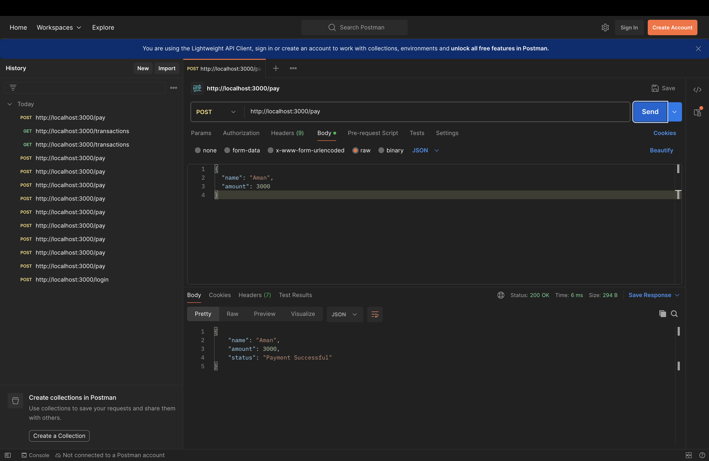
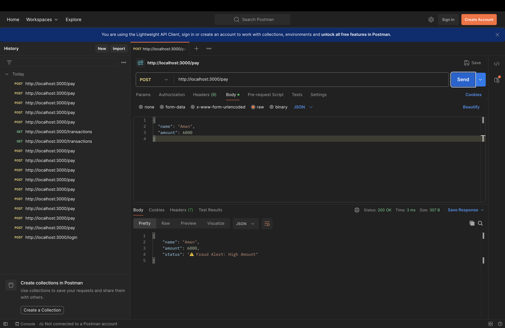
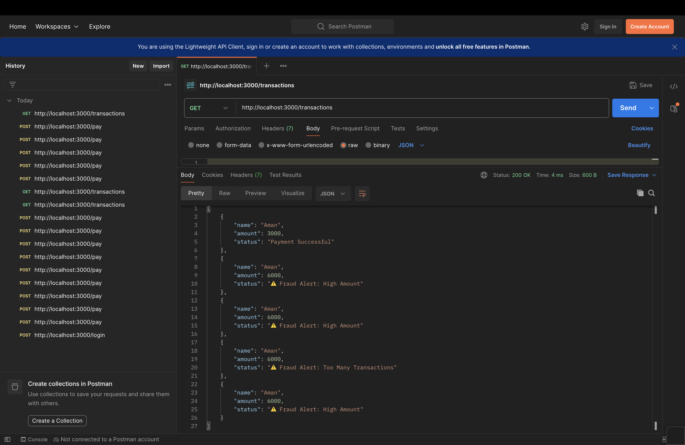

# Secure Electronic Payment System

## Description

The Secure Electronic Payment System is a backend REST API developed using Node.js and Express.  
It simulates a real-world payment system with integrated security features such as fraud detection, API key authentication, and input validation.

This project demonstrates secure backend development practices and safe transaction handling.

---

## Features

### Payment Processing

- Enables users to perform payment transactions
- Accepts user name and transaction amount
- Returns transaction status instantly

### Fraud Detection

- Identifies suspicious transactions based on:
  - High transaction amount (greater than 5000)
  - Multiple transactions within a short period

### API Key Authentication

- Secures all endpoints using a predefined API key
- Prevents unauthorized access

### Input Validation

- Ensures required fields are provided
- Validates that transaction amounts are positive

### Transaction History

- Stores transaction records
- Provides an endpoint to retrieve transaction data

---

## Tech Stack

- Node.js
- Express.js
- Postman (for API testing)

---

## Project Structure

secure-payment-system/
│── payment.js
│── package.json
│── package-lock.json
│── README.md

---

## API Endpoints

### Login

POST /login

### Payment

POST /pay

### Transactions

GET /transactions

---

## How to Run

1. Install dependencies  
   npm install

2. Run the server  
   node payment.js

3. Test APIs using Postman  
   Add the following header:

## x-api-key: 12345

## Security Features

- API key-based authentication
- Input validation
- Fraud detection using rule-based logic
- Controlled access to endpoints

---

## Screenshots

### Payment Success

### Fraud Detection

### Transaction History

---

## Future Improvements

- Integration with database (MongoDB/MySQL)
- Implementation of JWT-based authentication
- Development of frontend interface
- Advanced fraud detection mechanisms

---

## Author

Aman Bhadani
